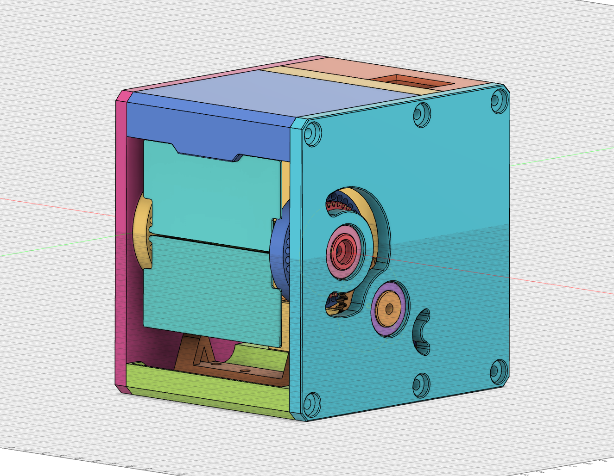
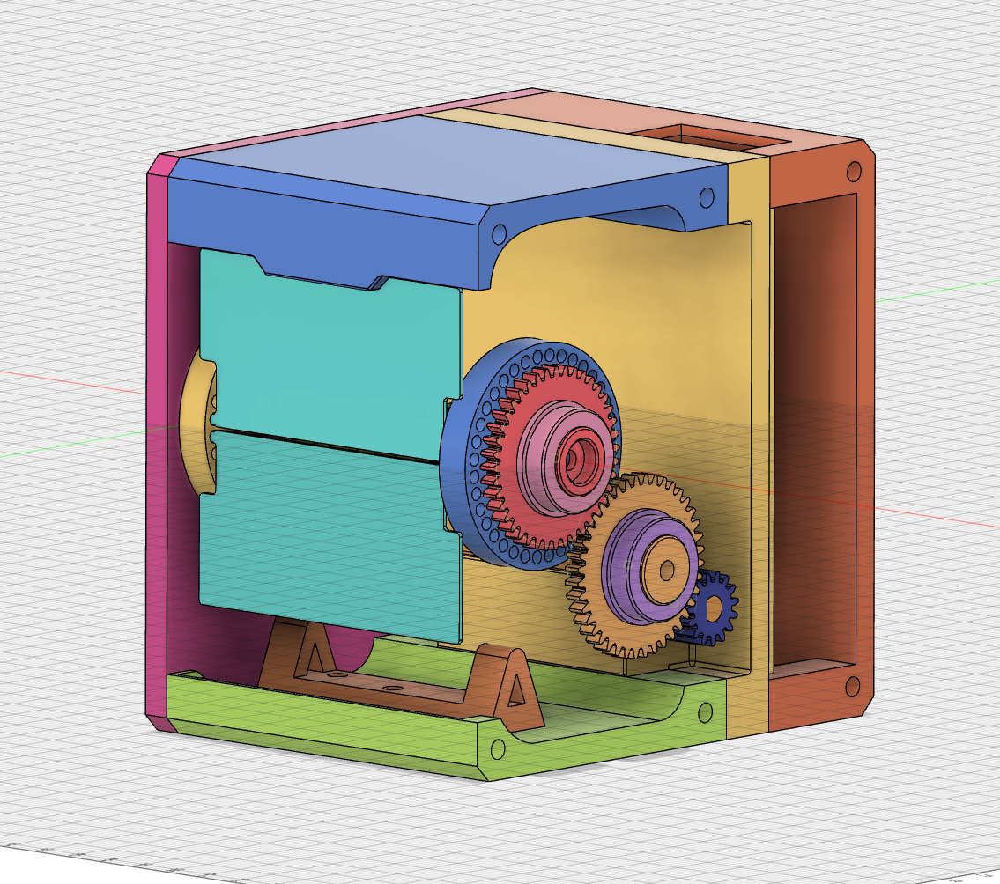
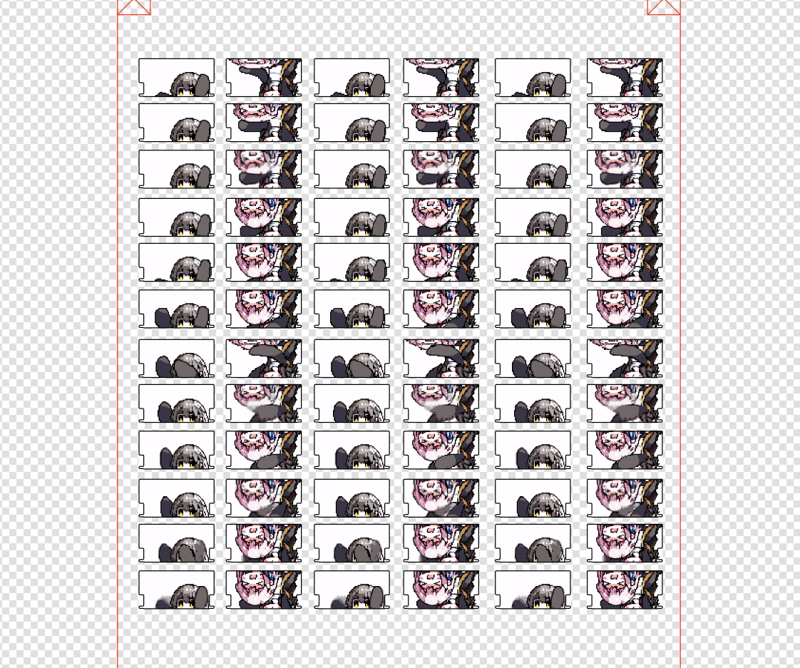

# Run-Something

## 程序部分

- QT

参考 [`Kyome22/RunCat_for_windows`](https://github.com/Kyome22/RunCat_for_windows) 获取 CPU 使用情况，并发布在 `Socket` 中

- ESP32

获取 CPU 使用率后输入至 PWM 的占空比控制点击转速

## 模型部分

模式部分使用 Fusion360 进行建模

示意如下

## 面板

面板选择嘉立创面板打印，已开源在立创开源平台

项目地址
- **[https://oshwhub.com/rcxxx/runsometingcrad-v2-0](https://oshwhub.com/rcxxx/runsometingcrad-v2-0)**

## 参考
- **[Kyome22/RunCat_for_windows](https://github.com/Kyome22/RunCat_for_windows)**
- **[分析一个跨平台QT项目(获取系统CPU使用率和内存占用率)](https://blog.csdn.net/yang1fei2/article/details/124217654)**